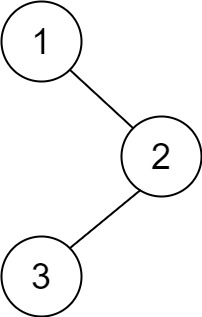

## 145. Binary Tree Postorder Traversal


https://leetcode.com/problems/binary-tree-postorder-traversal/


```
Given the root of a binary tree, return the postorder traversal of its nodes' values.
```

#### Example 1:

```
Input: root = [1,null,2,3]
Output: [3,2,1]

```

#### Example 2:
```
Input: root = []
Output: []
```

#### Example 3:
```
Input: root = [1]
Output: [1]
```

#### Constraints:
```
The number of the nodes in the tree is in the range [0, 100].
-100 <= Node.val <= 100
```

## Solutions

## Java

### Approach 1 : Recursive


```

/**
 * Definition for a binary tree node.
 * public class TreeNode {
 *     int val;
 *     TreeNode left;
 *     TreeNode right;
 *     TreeNode() {}
 *     TreeNode(int val) { this.val = val; }
 *     TreeNode(int val, TreeNode left, TreeNode right) {
 *         this.val = val;
 *         this.left = left;
 *         this.right = right;
 *     }
 * }
 */
class Solution {
    public List<Integer> postorderTraversal(TreeNode root) {
        List<Integer> ans = new ArrayList<>();
        postOrder(root, ans);
        return ans;

    }

    public static void postOrder(TreeNode root, List<Integer> ans) {
        if(root == null) {
            return;
        }

        postOrder(root.left, ans);
        postOrder(root.right, ans);
        ans.add(root.val);
    }
}

```

### Approach 1 : Recursive

```
/**
 * Definition for a binary tree node.
 * public class TreeNode {
 * int val;
 * TreeNode left;
 * TreeNode right;
 * TreeNode() {}
 * TreeNode(int val) { this.val = val; }
 * TreeNode(int val, TreeNode left, TreeNode right) {
 * this.val = val;
 * this.left = left;
 * this.right = right;
 * }
 * }
 */

/*
 * Iterative Approach:
 * 
 * 1. Create a Integer type ArrayList named preorder;
 * 2. Create a TreeNode type Stack named st;
 * 3. First push the root of the tree;
 * 4. pop the root from stack
 * 5. push the right child of the root(as we use stack so we have to push right
 * child then left child)
 * 6. push the left child of the root
 * 7. Repeat step 4,5,6 until the stack becomes empty
 */
class Solution {
    public List<Integer> preorderTraversal(TreeNode root) {
        List<Integer> preorder = new ArrayList<Integer>();
        if (root == null) {
            return preorder;
        }

        Stack<TreeNode> st = new Stack<TreeNode>();
        st.push(root);
        while (!st.isEmpty()) {
            root = st.pop();
            preorder.add(root.val);
            if (root.right != null) {
                st.push(root.right);
            }

            if (root.left != null) {
                st.push(root.left);
            }
        }

        return preorder;
    }
}
```