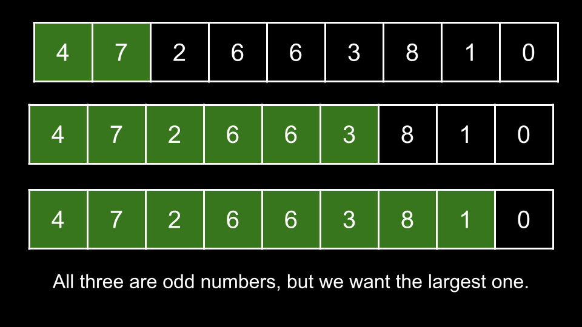

## 1903. Largest Odd Number in String


https://leetcode.com/problems/largest-odd-number-in-string/

You are given a string num, representing a large integer. Return the largest-valued odd integer (as a string) that is a non-empty substring of num, or an empty string "" if no odd integer exists.

A substring is a contiguous sequence of characters within a string.


#### Example 1:
```
Input: num = "52"
Output: "5"
Explanation: The only non-empty substrings are "5", "2", and "52". "5" is the only odd number.
```

#### Example 2:
```
Input: num = "4206"
Output: ""
Explanation: There are no odd numbers in "4206".
```

#### Example 3:
```
Input: num = "35427"
Output: "35427"
Explanation: "35427" is already an odd number.
```

#### Constraints:
```
1 <= num.length <= 105
num only consists of digits and does not contain any leading zeros.
```

## Solutions

### Approach: Find the Rightmost Odd Digit
#### Intuition

A number is odd if and only if its rightmost digit is odd.

For any given substring of num, if the final character of the substring represents an odd number, then the entire substring's integer representation will also be odd.

As we are looking for the largest-valued substring, we should aim to maximize the length of our substring, as each additional character increases the integer representation's value by a magnitude.

Where should our substring start? The answer is at the beginning of num. Why? The only factor that determines if a number is odd is the final character - nothing else matters. Thus, there is no downside to starting from a given location, and by starting at the beginning of num, we are maximizing the size of our substring.

Where should our substring end? As mentioned above, we need it to end on a character that represents an odd digit. Of all the odd digits in num, which one should we choose? As we are trying to maximize the length, we should choose the rightmost one.



This brings us to our solution. We will iterate over each letter of nums, starting from the right. The first time we find an odd digit, we know this digit is the rightmost odd digit. Thus, we immediately return the substring of nums that begins at index 0 and ends at the current digit. We can determine if a character represents an odd digit by casting it to an integer and calculating its remainder when divided by 2 (which is also commonly known as taking its value mod 2). If the result is 0, then it is an even digit, otherwise, it is an odd digit.

If nums doesn't have any odd digits, then it's impossible to form an odd number. We return "" in that case.

### Algorithm
```
1. Iterate i starting from nums.length - 1 to 0:
    a. Cast nums[i] to an integer and take its value mod 2. If the result is not 0:
        i. Return the substring of nums starting at index 0 and ending with index i.
2. Return "".

``` 
* **Java**

```
class Solution {
    public String largestOddNumber(String num) {
        for(int i=num.length()-1; i>=0; i--) {
            if(Character.getNumericValue(num.charAt(i)) % 2 != 0) {
                return num.substring(0,i+1);
            }
        }
        
        return "";
    }
}
```