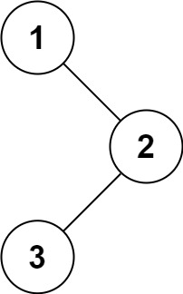

## 94. Binary Tree Inorder Traversal


https://leetcode.com/problems/binary-tree-inorder-traversal/


```
Given the root of a binary tree, return the inorder traversal of its nodes' values.
```

#### Example 1:

```
Input: root = [1,null,2,3]
Output: [1,3,2]
```

#### Example 2:
```
Input: root = []
Output: []
```

#### Example 3:
```
Input: root = [1]
Output: [1]
```

#### Constraints:
```
The number of nodes in the tree is in the range [0, 100].
-100 <= Node.val <= 100
```

## Solutions


* **Java**

### Approach 1 : Recursive

```

/**
 * Definition for a binary tree node.
 * public class TreeNode {
 *     int val;
 *     TreeNode left;
 *     TreeNode right;
 *     TreeNode() {}
 *     TreeNode(int val) { this.val = val; }
 *     TreeNode(int val, TreeNode left, TreeNode right) {
 *         this.val = val;
 *         this.left = left;
 *         this.right = right;
 *     }
 * }
 */
class Solution {
    public List<Integer> inorderTraversal(TreeNode root) {
       List<Integer> ans = new ArrayList<>();
       inOrder(root, ans);
       return ans; 
    }

    public static void inOrder(TreeNode root, List<Integer> ans) {
        if(root == null) {
            return;
        }

        inOrder(root.left, ans);
        ans.add(root.val);
        inOrder(root.right, ans);  
    }
}

```