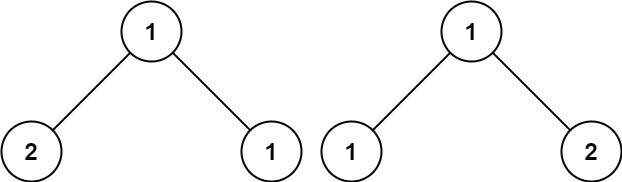

## 100. Same Tree


https://leetcode.com/problems/same-tree/


```
Given the roots of two binary trees p and q, write a function to check if they are the same or not.

Two binary trees are considered the same if they are structurally identical, and the nodes have the same value.
```

#### Example 1:

```
Input: p = [1,2,3], q = [1,2,3]
Output: true
```

#### Example 2:

```
Input: p = [1,2], q = [1,null,2]
Output: false
```

#### Example 3:

```
Input: p = [1,2,1], q = [1,1,2]
Output: false

```

#### Constraints:
```
The number of nodes in both trees is in the range [0, 100].
-104 <= Node.val <= 104
```

## Solutions


* **Java**

```
Steps:
1. In order to check whether two trees are identical or not, we need to traverse the trees. 
2. While traversing we first check the value of the nodes, 
    if they are unequal we can simply return false, 
    as trees are non-identical. 
3. If they are the same, 
    then we need to recursively check their left child as well as the right child.
4.When we get all the three values as true(node values, left child, right child)   
    we can conclude that these are identical trees and can return true. 
    Any other combination will return false.
```

```

/**
 * Definition for a binary tree node.
 * public class TreeNode {
 *     int val;
 *     TreeNode left;
 *     TreeNode right;
 *     TreeNode() {}
 *     TreeNode(int val) { this.val = val; }
 *     TreeNode(int val, TreeNode left, TreeNode right) {
 *         this.val = val;
 *         this.left = left;
 *         this.right = right;
 *     }
 * }
 */
class Solution {
    public boolean isSameTree(TreeNode p, TreeNode q) {
        if(p == null && q == null) {
            return true;
        }
        if(p == null || q == null ) {
            return false;
        }

         return ((p.val == q.val) && isSameTree(p.left, q.left) && isSameTree(p.right, q.right));
        
    }
}

```