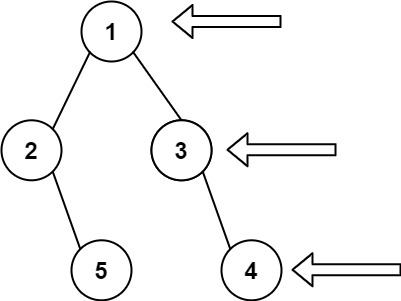

## 199. Binary Tree Right Side View


https://leetcode.com/problems/binary-tree-right-side-view/


```
Given the root of a binary tree, imagine yourself standing on the right side of it, return the values of the nodes you can see ordered from top to bottom.
```

#### Example 1:

```
Input: root = [1,2,3,null,5,null,4]
Output: [1,3,4]

```

#### Example 2:
```
Input: root = [1,null,3]
Output: [1,3]
```

#### Example 3:
```
Input: root = []
Output: []
```

#### Constraints:
```
The number of nodes in the tree is in the range [0, 100].
-100 <= Node.val <= 100
```

## Solutions

* **Java**

```
Steps:
1. Create an vector data structure inside the rightSideView(TreeNode root).
2. Call for the recursive_right function with the (root,vector,level). Here level will be initially passed as 0.
3. Return the vector.

Now in recursive rightView() :
    1. If vector size is equal to the level then push_back its node value to the vector data structure.
    2. Otherwise call recursive_right for (node->right,vector,level+1)
    3. Call recursive_right for (node->left,vector,level+1)

```

```
/**
 * Definition for a binary tree node.
 * public class TreeNode {
 *     int val;
 *     TreeNode left;
 *     TreeNode right;
 *     TreeNode() {}
 *     TreeNode(int val) { this.val = val; }
 *     TreeNode(int val, TreeNode left, TreeNode right) {
 *         this.val = val;
 *         this.left = left;
 *         this.right = right;
 *     }
 * }
 */
class Solution {
    public List<Integer> rightSideView(TreeNode root) {
        List<Integer> result = new ArrayList<Integer>();
        rightView(root, result, 0);
        return result;
    }

    public void rightView(TreeNode curr, List<Integer> result, int currDepth) {
        if(curr == null) {
            return;
        }
        if(currDepth == result.size()) {
            result.add(curr.val);
        }
        rightView(curr.right, result, currDepth + 1);
        rightView(curr.left, result, currDepth + 1);
    }
}


```