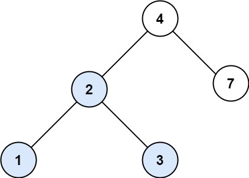
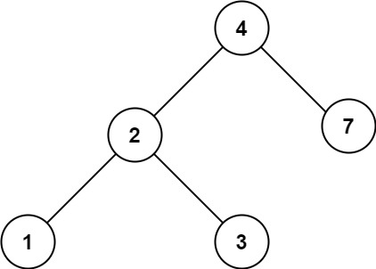

## 700. Search in a Binary Search Tree


https://leetcode.com/problems/search-in-a-binary-search-tree/


```
You are given the root of a binary search tree (BST) and an integer val.

Find the node in the BST that the node's value equals val and return the subtree rooted with that node. If such a node does not exist, return null.
```

#### Example 1:

```
Input: root = [4,2,7,1,3], val = 2
Output: [2,1,3]

```

#### Example 2:

```
Input: root = [4,2,7,1,3], val = 5
Output: []
```


#### Constraints:
```
The number of nodes in the tree is in the range [1, 5000].
1 <= Node.val <= 107
root is a binary search tree.
1 <= val <= 107
```

## Solutions

```
Steps:

1. Set a while loop which runs till the time root is not NULL and root’s value is not equal to the target value we are searching for.
2. Inside the while loop, 
    if the target value is less than the root’s value, move root to its left child, 
    else move root to its right child.
3. When the while loop ends, return root as the answer.
```

* **Java**

```
/**
 * Definition for a binary tree node.
 * public class TreeNode {
 *     int val;
 *     TreeNode left;
 *     TreeNode right;
 *     TreeNode() {}
 *     TreeNode(int val) { this.val = val; }
 *     TreeNode(int val, TreeNode left, TreeNode right) {
 *         this.val = val;
 *         this.left = left;
 *         this.right = right;
 *     }
 * }
 */
class Solution {
    public TreeNode searchBST(TreeNode root, int val) {
        while(root != null && root.val != val) {
            if(val < root.val) {
                root = root.left;
            } else {
                root = root.right;
            }
        }

        return root; 
    }
}


```