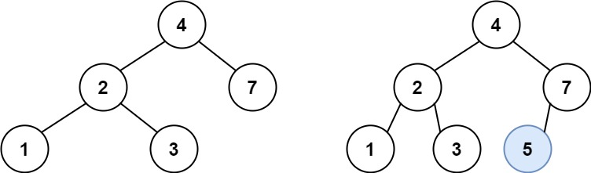
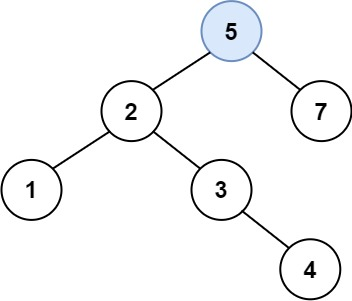

## 701. Insert into a Binary Search Tree


https://leetcode.com/problems/insert-into-a-binary-search-tree/


```
You are given the root node of a binary search tree (BST) and a value to insert into the tree. Return the root node of the BST after the insertion. It is guaranteed that the new value does not exist in the original BST.

Notice that there may exist multiple valid ways for the insertion, as long as the tree remains a BST after insertion. You can return any of them.
```

#### Example 1:

```
Input: root = [4,2,7,1,3], val = 5
Output: [4,2,7,1,3,5]
Explanation: Another accepted tree is:
```


#### Example 2:
```
Input: root = [40,20,60,10,30,50,70], val = 25
Output: [40,20,60,10,30,50,70,null,null,25]
```

#### Example 3:
```
Input: root = [4,2,7,1,3,null,null,null,null,null,null], val = 5
Output: [4,2,7,1,3,5]
```

#### Constraints:
```
The number of nodes in the tree will be in the range [0, 104].
-108 <= Node.val <= 108
All the values Node.val are unique.
-108 <= val <= 108
It's guaranteed that val does not exist in the original BST.
```

## Solutions


* **Java**

```
Steps: 
1. If the root node is null, create a new node, with the given value and return it as the new root
2. Create a curr pointer to traverse the tree;
3. Run a while loop to traverse the tree to find the appropriate position for insertion
    i) If the current node's value is less than or equal to the value to be inserted, move to the right subtree.
        a) If the right child of the current node is not null, update 'cur' to the right child.
        b) If the right child is null, 
            create a new node and exit the while loop.
    ii) If the current node's value is greater than the value to be inserted,
        move to the left subtree
        a) If the left child of the current node is not null, 
            update 'cur' to the left child.
        b) If the left child is null, 
            create a new node with the given value as the left child
            and exit the while loop
4. Return the root of the modified tree after insertion

```


```
/**
 * Definition for a binary tree node.
 * public class TreeNode {
 *     int val;
 *     TreeNode left;
 *     TreeNode right;
 *     TreeNode() {}
 *     TreeNode(int val) { this.val = val; }
 *     TreeNode(int val, TreeNode left, TreeNode right) {
 *         this.val = val;
 *         this.left = left;
 *         this.right = right;
 *     }
 * }
 */
class Solution {
    public TreeNode insertIntoBST(TreeNode root, int val) {
        // If the root node is null, create a new node
        // with the given value and return it as the new root
        if(root == null) {
            return new TreeNode(val);
        }

        // curr pointer to traverse the tree
        TreeNode curr = root;

        // while loop to traverse the tree to find the 
        // appropriate position for insertion

        while(true) {
            // If the current node's value is less than or 
            // equal to the value to be inserted, move to the right subtree
            if(curr.val <= val) {
                // If the right child of the current node
                // is not null, update 'cur' to the right child
                if (curr.right != null) {
                    curr = curr.right;
                }
                // If the right child is null, create a new node
                // with the given value as the right child
                // and exit the while loop
                else {
                    curr.right = new TreeNode(val);
                    break;
                }

            } 
            // If the current node's value is greater than
            // the value to be inserted,
            // move to the left subtree
            else {
                // If the left child of the current node
                // is not null, update 'cur' to the left child
                if (curr.left != null) {
                    curr = curr.left;
                }
                // If the left child is null, create a new node
                // with the given value as the left child
                // and exit the while loop
                else {
                    curr.left = new TreeNode(val);
                    break;
                } 
            }

        }

        // Return the root of the modified tree after insertion
        return root;
    }
}


```