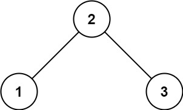
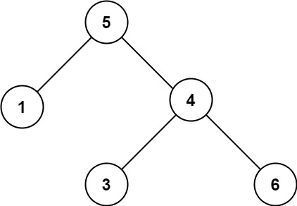
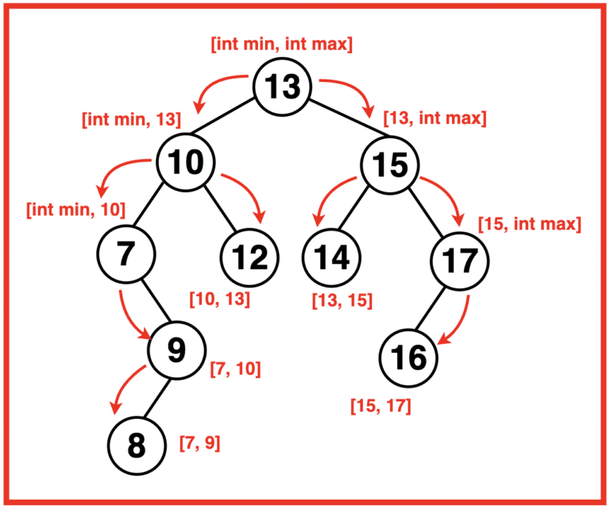

## 98. Validate Binary Search Tree


https://leetcode.com/problems/binary-tree-preorder-traversal/


```
Given the root of a binary tree, determine if it is a valid binary search tree (BST).

A valid BST is defined as follows:

The left 
subtree
 of a node contains only nodes with keys less than the node's key.
The right subtree of a node contains only nodes with keys greater than the node's key.
Both the left and right subtrees must also be binary search trees.
```

#### Example 1:

```
Input: root = [2,1,3]
Output: true
```

#### Example 2:


```
Input: root = [5,1,4,null,null,3,6]
Output: false
Explanation: The root node's value is 5 but its right child's value is 4.
```

#### Constraints:
```
Input: root = [5,1,4,null,null,3,6]
Output: false
Explanation: The root node's value is 5 but its right child's value is 4.
```

## Solutions


* **Java**

```
Steps:
Step 1: Start at the root of the binary tree and define a recursive function isValidBST that takes a node, along with its minimum and maximum allowed values as arguments.
    a) If the node is null, return true as that would be a valid BST.
    b) If the node’s value is outside the given range (smaller than the min value or greater than the max value), return false.
Step 2: Call the isValidBST function starting from the root node with an initial range of minimum and maximum values that cover the full range of possible values (negative int min to positive int max). 
    If the function returns true, the tree is a valid BST; otherwise, it’s not.

```

```
Step 3: Recursively call isValidBST for each node by updating the maximum allowed value 
for the left subtree to be less than the current node’s value and 
updating the minimum allowed value for the right subtree to be more than 
the current node’s value.
```


```
// Function to check if a given binary
    // tree is a valid binary search tree (BST)
    public boolean isValid(TreeNode root) {
        // Calls the helper function isValidBST
        // with initial min and max values
        return isValidBST(root, Long.MIN_VALUE, Long.MAX_VALUE);
    }

// Helper function to recursively validate the BST property
    public boolean isValidBST(TreeNode root, long minVal, long maxVal) {
        if (root == null) {
            // Base case: an empty
            // tree is a valid BST
            return true;
        }

        // Checks if the current node
        // violates the BST property
        if (root.val >= maxVal || root.val <= minVal) {
            return false;
        }

        // Recursively checks left and right
        // subtrees with updated constraints
        // that every value on its left subtree
        // should be smaller than the current node
        // and every value on its right subtree
        // should be greater than the current node
        return isValidBST(root.left, minVal, root.val)
                && isValidBST(root.right, root.val, maxVal);
    }
```

```

/**
 * Definition for a binary tree node.
 * public class TreeNode {
 *     int val;
 *     TreeNode left;
 *     TreeNode right;
 *     TreeNode() {}
 *     TreeNode(int val) { this.val = val; }
 *     TreeNode(int val, TreeNode left, TreeNode right) {
 *         this.val = val;
 *         this.left = left;
 *         this.right = right;
 *     }
 * }
 */
class Solution {
    public boolean isValidBST(TreeNode root) {
        return isValid(root, Long.MIN_VALUE, Long.MAX_VALUE);
    }

    public boolean isValid(TreeNode root, long minVal, long maxVal) {
        if(root == null) {
            return true;
        }
        if(root.val >= maxVal || root.val <= minVal) {
            return false;
        }
        return isValid(root.left, minVal, root.val) && isValid(root.right, root.val, maxVal);
    }
}

```